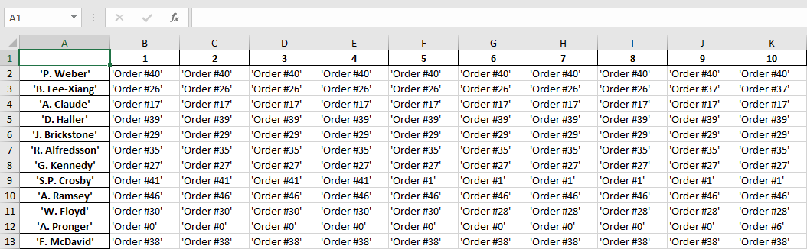

# Multi-Agent System
___
## Description
A _Multi-Agent System_ (_MAS_ or "self-organized system") is a computerized system composed of multiple interacting intelligent agents. MAS can solve problems that are difficult or impossible for an individual agent or a monolithic system to solve. Intelligence may include methodic, functional, procedural approaches, algorithmic search or reinforcement learning.

Despite considerable overlap, a multi-agent system is not always the same as an agent-based model (ABM). The goal of an ABM is to search for explanatory insight into the collective behavior of agents (which don't necessarily need to be "intelligent") obeying simple rules, typically in natural systems, rather than in solving specific practical or engineering problems. The terminology of ABM tends to be used more often in the science, and _MAS_ in engineering and technology. Applications where multi-agent systems research may deliver an appropriate approach include online trading, disaster response, target surveillance and social structure modelling.

This work was performed at the 8th semester of study at the _USATU_ (specialty of _Mathematical software and administration of information systems_) on the subject of _AI Methods_.

## Technology
_Java Agent Development Framework_, or _JADE_, is a software framework for the development of intelligent agents, implemented in Java. JADE system supports coordination between several agents __FIPA__ and provides a standard implementation of the communication language __FIPA-ACL__, which facilitates the communication between agents and allows the services detection of the system. JADE was originally developed by Telecom Italia and is distributed as free software.

## Installation
1. Open project on _IDE_ (for example _[Intellij IDEA](https://www.jetbrains.com/ru-ru/idea/download/#section=windows)_)
2. Run application
3. Copy listening address
4. Edit host in file _'Factory.bat'_
5. Run _'Factory.bat'_
6. Wait console message about the end of the program
7. Run _'json2xlsx.py'_
8. Result will be in the file _'output.xlsx'_

## Example
Output schedule for _[input data](input.json)_ :point_down:

